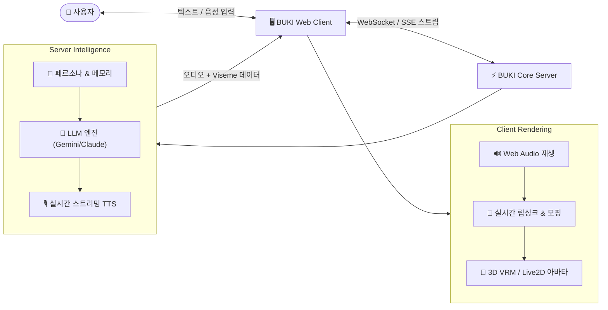

# 🔮 Project BUKI (`project_buki`) - System Bible

> **차세대 인터랙티브 AI 컴패니언 & 버츄얼 아바타 시스템**  
> *LLM Streaming Chat × Real-time High-Quality TTS × 3D/2D Virtual Avatar Engine*

---

## 🌟 1. 프로젝트 비전 (Vision & Objective)

**Project BUKI**는 사용자와 실시간으로 교감하는 지능형 버츄얼 아바타 시스템입니다.
단순한 텍스트 챗봇을 넘어, **감정이 실린 자연스러운 음성(TTS)**과 **오디오 기반 실시간 립싱크 및 표정 변화를 지원하는 버츄얼 아바타(VRM / Live2D)**를 웹 브라우저 환경에서 경량으로 구동하는 것을 목표로 합니다.

---

## 🎯 2. 4대 핵심 기둥 (Core Pillars)

1. **지능형 페르소나 챗 & 대사/지문 분리 엔진 (Persona & Parser Intelligence)**
   - 캐릭터별 말투, 가치관, 컨텍스트를 유지하는 동적 프롬프트 파이프라인.
   - 대사(TTS 발화)와 지문/행동(UI 시각화)을 실시간으로 3계층 분리.
2. **Multi-TTS 하이브리드 음성 엔진 (Tri-Engine Hybrid TTS)**
   - GPT-SoVITS (3초 제로샷 캐릭터 복제) + Chatterbox 0.5B (호흡/의성어 태그 제어) + Edge-TTS 자동 폴백.
3. **10대 극적 연기 감정 & 대본 낭독기 (10 Acting Emotions & Script Reader)**
   - 공포(1.16x+떨림), 체념(0.78x+한숨), 신음/달아오름(0.90x+성대떨림), 속삭임(ASMR) 등 극적 억양 파이프라인.
   - 소설/대본 텍스트를 대사와 지문으로 자동 분할하고 문맥별 감정 톤으로 실시간 연속 낭독.
4. **웹 기반 버츄얼 아바타 렌더러 (Web Virtual Avatar Engine)**
   - Three.js 기반 `@pixiv/three-vrm` 3D 아바타 렌더링.
   - 자연스러운 시선 추적, 립싱크 모핑, 대기 모션(Idle Motion).

---

## 🗺️ 3. 개발 로드맵 요약

* **Phase 1 (MVP & Multi-TTS)**: LLM 실시간 스트리밍 챗 + GPT-SoVITS / Chatterbox / Edge-TTS 트라이 엔진 + 대사/지문 3계층 파서. ✅ **완료**
* **Phase 2 (10 Acting Emotions & Script Reader)**: 10대 극적 연기 감정 프로소디 + 대본 낭독기 2-Way 연동 + 모바일/Tailscale 최적화. ✅ **완료**
* **Phase 3 (3D VRM Avatar & Viseme LipSync)**: Three.js 3D VRM 아바타 연동, 오디오 파형 기반 실시간 립싱크 및 표정 상태머신. ⏳ **예정**

---

## 📂 4. 위키 및 지식 베이스 네비게이션

* 👥 [페르소나 레지스트리](./wiki/01_personas/index.md)
* 🗺️ [전체 로드맵 명세](./wiki/02_roadmap_tasks/ROADMAP.md)
* 📋 [태스크 백로그](./wiki/02_roadmap_tasks/TASK_BACKLOG.md)
* ⚙️ [시스템 아키텍처 상세](./wiki/03_architecture/SYSTEM_DESIGN.md)
* 📜 [개발 로그 아카이브](./wiki/04_logs/DEV_LOG.md)