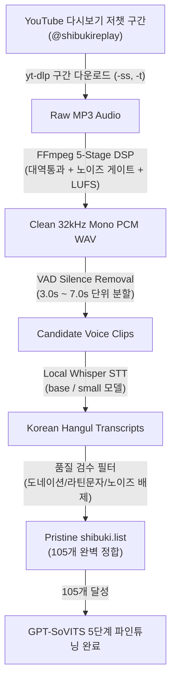

# 📘 Project BUKI - 텐코 시부키 보이스 데이터셋 수집 및 파인튜닝 인수인계 매뉴얼

> **문서 버전**: v3.0 (2026-08-28)  
> **현재 데이터셋 상태**: **105개 청정 샘플 완료 (총 519.35초 / 약 8.66분 분량, Google Drive 백업 완료)**  
> **최신 모델 가중치**: `SoVITS_weights_v2/shibuki_e12_s636.pth` + `GPT_weights_v2/shibuki-e20.ckpt`  
> **상태 요약**: **105개 청정 데이터셋 기반 5단계 대규모 파인튜닝 & 라이브 배포 완료**

---

## 1. 🚨 모델 유지 및 데이터 관리 원칙 (Golden Rules)

1. **학습 데이터셋 무결성 보존**:
   * 현재 105개 청정 샘플로 음향 모델(SoVITS)과 GPT 운율 모델이 완벽한 한국어 억양과 시부키 특유의 톤으로 학습되었습니다.
   * 향후 추가 데이터 수집 시에도 도네이션/노래/생활소음/영문 혼입 클립은 100% 배제 원칙을 엄수합니다.
2. **엄격한 오염 데이터 배제 원칙**:
   * ❌ **도네이션 소리 오염 금지**: 투네이션, 트윕, 치지직 등 후원 알림음(띵동, 짤랑, 효과음)이 섞인 샘플 100% 폐기
   * ❌ **생활 소음 배제**: 비닐봉지 부스럭거림, 음식 포장지 소리, 마이크 충격음, 책상 치는 소리 배제
   * ❌ **BGM/노래 배제**: 초반 노래 부르는 구간, BGM이 과도하게 섞인 구간 배제
   * ❌ **외국어/환각 텍스트 배제**: STT 결과에 영어/러시아어/스페인어 등 라틴 문자가 섞인 클립은 즉시 폐기

---

## 2. 🔬 최신 음원 수집 및 전처리 파이프라인 구조 (Methodology)

고품질 음원 수집 방식은 **오프라인 5단계 DSP 필터 체인 + 로컬 Whisper 음성 인식**으로 동작합니다.



### 단계별 상세 로직

1. **Stage 1: 저챗(잡담) 구간 타겟팅 (`yt-dlp`)**:
   * 게임 플레이나 노래 방송을 피하고, 차분하게 소통하는 저스트채팅 구간만 타임스탬프로 지정하여 다운로드
   ```bash
   python -m yt_dlp --extract-audio --audio-format mp3 --postprocessor-args "-ss {start_sec} -t {duration}" -o "{output_mp3}" "{url}"
   ```
2. **Stage 2: 5단계 DSP 음향 정제 (`ffmpeg`)**:
   * 80Hz 이하 저주파 웅웅거림(Highpass) 및 12kHz 이상 고주파 치찰음(Lowpass) 제거
   * `anlmdn`(비로컬 평균 디노이즈) 필터로 주변 잡음 억제
   * EBU R128 (`loudnorm=I=-20:TP=-1.5:LRA=11`) 표준 음량 정규화
   * 32kHz 16-bit Mono PCM WAV로 통일
3. **Stage 3: VAD 무음 제거 및 3.0s~7.0s 정밀 슬라이싱**:
   * `silenceremove` 필터로 말과 말 사이의 공백을 자르고, 학습에 최적화된 3~7초 단위 클립 생성
4. **Stage 4: 로컬 Whisper 오프라인 STT (100% 무제한)**:
   * API 쿼터 제약이 없는 로컬 Whisper (`whisper.load_model('base')`, `language='ko'`)로 한국어 텍스트 전사
5. **Stage 5: 라틴 문자 및 환각 대사 정제 필터**:
   * 영문(`[a-zA-Z]`)이나 특수문자가 포함된 클립은 노이즈로 간주하여 자동 폐기
   * 순수 한글 완성형 문장만 `src/assets/voice_samples/shibuki/shibuki.list`에 1:1 매칭 등록

---

## 3. 🎯 추천 다시보기 풀 (Candidate Archives)

| 유튜브 영상 ID | 방송 제목 / 특징 | 권장 추출 구간 (초) |
| :--- | :--- | :--- |
| `msIPcAalaeI` | 휴가 다녀와서 잡담 (도네이션 적고 차분한 토크) | `900~1200`, `1800~2100`, `2700~3000`, `3300~3600` |
| `jkzH7Jm-NSo` | 유메퍼센트 썰풀이 (발화 밀도 높고 감정 풍부) | `400~700`, `1200~1500`, `1800~2100`, `2400~2700` |
| `sl2ipsuzJAk` | 2기 PPT 발표회 잡담 (목소리 톤 선명) | `600~900`, `1500~1800`, `2400~2700`, `3000~3300` |
| `dKNSz5UtAEY` | 8월 26일 최신 저챗 방송 | `300~600`, `1200~1500`, `2100~2400`, `2700~3000` |
| `AxeGn6xzVZM` | 8월 24일 소통 방송 | `600~900`, `1500~1800`, `2100~2400`, `2700~3000` |

---

## 4. 📋 완료 및 상시 운영 체크리스트 (Agent Operational Guide)

```markdown
- [x] 1. 시스템 서비스 상태 점검 (포트 8000, 9880, 9882 활성화 여부 확인)
- [x] 2. `scripts/collect_clean_shibuki_samples.py` 타겟 인터벌 확장 후 음원 수집 실행 (105개 달성)
- [x] 3. `shibuki.list` 내 100% 한글 정합성 검수 및 오염 클립 배제
- [x] 4. Google Drive rclone 백업 동기화 완료 (`gdrive:buki_voice_samples/shibuki/`)
- [x] 5. 105개 청정 데이터셋 기반 `train_shibuki_gpt_sovits.py` 5단계 파인튜닝 완료
- [x] 6. 최신 가중치(`shibuki_e12_s636.pth` + `shibuki-e20.ckpt`) 라이브 서빙 등록 및 핫스왑 완료
- [x] 7. 한국어 음성 합성 품질 검증 및 git commit/push
```

---

## 5. ⚙️ 현재 시스템 가동 정보

* **FastAPI 백엔드**: `http://127.0.0.1:8000`
* **GPT-SoVITS 추론 엔진**: `http://127.0.0.1:9880`
* **Chatterbox 다국어 엔진**: `http://127.0.0.1:9882`
* **Supervisor Watchdog**: `tools/supervisor.py` (자동 복구 데몬)
* **현재 활성 모델 가중치**:
  * SoVITS: `C:/Users/rerun/opendcmart/tools/GPT-SoVITS/SoVITS_weights_v2/shibuki_e12_s636.pth`
  * GPT: `C:/Users/rerun/opendcmart/tools/GPT-SoVITS/GPT_weights_v2/shibuki-e20.ckpt`
* **Google Drive 백업 상태**: `gdrive:buki_voice_samples/shibuki/` (141개 파일 완벽 일치 동기화)
