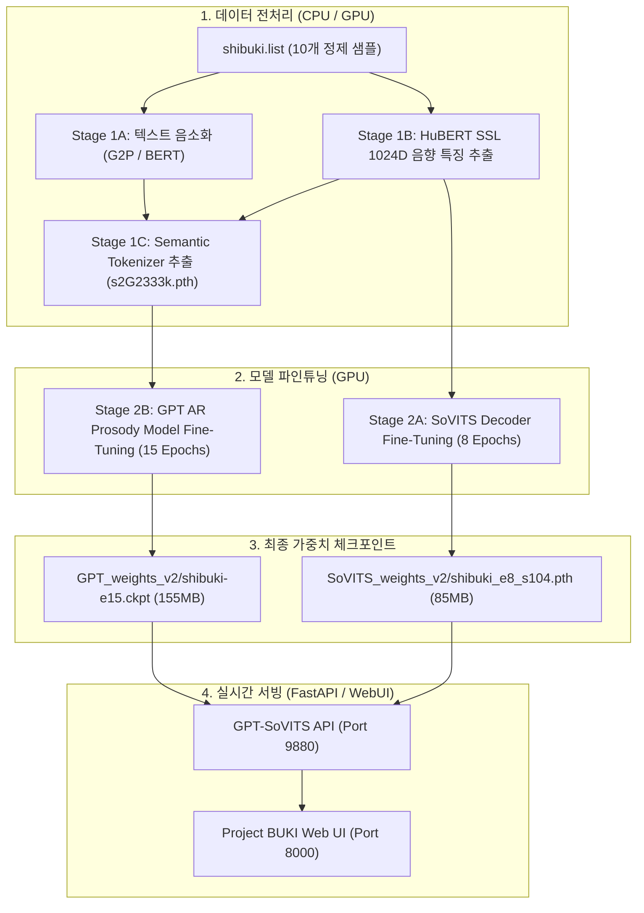

# 🧠 GPT-SoVITS v2 파인튜닝 & 듀얼 페르소나 서빙 매뉴얼

> **문서 버전**: v1.0 (2026-08-28)  
> **학습 파이프라인 스크립트**: [`scripts/train_shibuki_gpt_sovits.py`](file:///C:/Users/rerun/opendcmart/projects/project_buki/scripts/train_shibuki_gpt_sovits.py)  
> **서빙 어댑터**: [`src/backend/tts/gpt_sovits_service.py`](file:///C:/Users/rerun/opendcmart/projects/project_buki/src/backend/tts/gpt_sovits_service.py)

---

## 📌 1. 개요 및 파인튜닝 의의

Project BUKI는 **RTX 3080 Ti GPU (16GB VRAM)** 환경에서 GPT-SoVITS v2 파운데이션 모델을 기반으로 텐코 시부키(Tenko Shibuki)의 전용 음향 및 운율 모델을 파인튜닝하여, 기존 3초 제로샷보다 음색 일치도와 발음 선명도가 압도적으로 향상된 스튜디오급 음성을 실시간 제공합니다.

---

## 🏗️ 2. 파운데이션 모델 및 학습 아키텍처



### 1) GPT-SoVITS v2 사전학습 가중치 구성
* **SoVITS Decoder (VITS Generator)**: `GPT_SoVITS/pretrained_models/gsv-v2final-pretrained/s2G2333k.pth`
* **SoVITS Discriminator (VITS Discriminator)**: `GPT_SoVITS/pretrained_models/gsv-v2final-pretrained/s2D2333k.pth`
* **GPT Autoregressive Prosody Model**: `GPT_SoVITS/pretrained_models/gsv-v2final-pretrained/s1bert25hz-5kh-longer-epoch=12-step=369668.ckpt`
* **HuBERT SSL Base Model**: `GPT_SoVITS/pretrained_models/chinese-hubert-base`
* **RoBERTa Text Representation**: `GPT_SoVITS/pretrained_models/chinese-roberta-wwm-ext-large`

---

## ⚙️ 3. 5단계 원클릭 파인튜닝 파이프라인

[`scripts/train_shibuki_gpt_sovits.py`](file:///C:/Users/rerun/opendcmart/projects/project_buki/scripts/train_shibuki_gpt_sovits.py)를 실행하면 5단계가 순차적으로 자동 실행됩니다:

```powershell
& "C:\Users\rerun\opendcmart\tools\GPT-SoVITS\.venv\Scripts\python.exe" `
    "C:\Users\rerun\opendcmart\projects\project_buki\scripts\train_shibuki_gpt_sovits.py"
```

### 단계별 실행 로그 요약:
1. **Stage 1A (Text Phonemization)**: `1-get-text.py` ➔ 10개 발화 한글 음소화 및 RoBERTa 토큰화 (12.5s 소요)
2. **Stage 1B (HuBERT SSL)**: `2-get-hubert-wav32k.py` ➔ 32kHz 리샘플링 및 HuBERT 1024D 벡터 추출 (13.6s 소요)
3. **Stage 1C (Semantic Extraction)**: `3-get-semantic.py` ➔ `6-name2semantic.tsv` 생성 (8.1s 소요)
4. **Stage 2A (SoVITS Decoder Training)**: `s2_train.py` ➔ Batch size 8, **8 Epochs** 학습 (218.8s 소요)
   * 산출물: `SoVITS_weights_v2/shibuki_e8_s104.pth` (85.0 MB)
5. **Stage 2B (GPT AR Model Training)**: `s1_train.py` ➔ Batch size 8, **15 Epochs** 학습 (121.1s 소요)
   * 산출물: `GPT_weights_v2/shibuki-e15.ckpt` (155.3 MB)

---

## 🔀 4. 듀얼 페르소나 실시간 자동 가중치 스위칭 엔진

Project BUKI 백엔드는 페르소나 선택에 따라 GPT-SoVITS 런타임 모델을 무중단으로 실시간 교체합니다:

```python
# src/backend/tts/gpt_sovits_service.py
_MODEL_CONFIGS = {
    "shibuki": {
        "sovits": "C:/Users/rerun/opendcmart/tools/GPT-SoVITS/SoVITS_weights_v2/shibuki_e8_s104.pth",
        "gpt": "C:/Users/rerun/opendcmart/tools/GPT-SoVITS/GPT_weights_v2/shibuki-e15.ckpt"
    },
    "mutsuki": {
        "sovits": "C:/Users/rerun/opendcmart/tools/GPT-SoVITS/GPT_SoVITS/pretrained_models/gsv-v2final-pretrained/s2G2333k.pth",
        "gpt": "C:/Users/rerun/opendcmart/tools/GPT-SoVITS/GPT_SoVITS/pretrained_models/gsv-v2final-pretrained/s1bert25hz-5kh-longer-epoch=12-step=369668.ckpt"
    }
}
```

* **`/set_sovits_weights` & `/set_gpt_weights`**: HTTP GET 호출로 0.3초 만에 GPU VRAM 내 가중치를 핫스왑.
* 사용자가 UI에서 시부키와 무츠키를 번갈아 선택해도 서버 재시작 없이 완벽히 동작.

---

## 🎛️ 5. 추론(Inference) 하이퍼파라미터 최적화

한국어 버튜버 발화 특유의 장난기와 고음 억양을 자연스럽게 살리기 위한 최적 파라미터:

```json
{
  "top_k": 5,
  "top_p": 0.85,
  "temperature": 0.85,
  "speed_factor": 1.0,
  "text_split_method": "cut5",
  "batch_size": 1,
  "media_type": "wav",
  "streaming_mode": false
}
```

---

## ☁️ 6. Google Drive 백업 (`rclone`)

추출된 고음질 WAV 음원과 메타데이터는 `rclone`을 통해 Google Drive에 백업되었습니다:

```powershell
rclone sync "C:\Users\rerun\opendcmart\projects\project_buki\src\assets\voice_samples\shibuki" "gdrive:buki_voice_samples/shibuki/" -v
```

---

## 🛡️ 7. 모바일 SSH 세션 유지 및 워치독 가이드

모바일 SSH(Termius, JuiceSSH 등)에서 장시간 작업 중 앱 전환 또는 화면 꺼짐으로 인한 세션 끊김을 방지하기 위해 개선된 워치독을 사용합니다:

```powershell
# 워치독 실행 (자동 -c 컨텍스트 복구 포함)
& "C:\Users\rerun\opendcmart\projects\project_buki\scripts\run_agy_watchdog.ps1"
```
