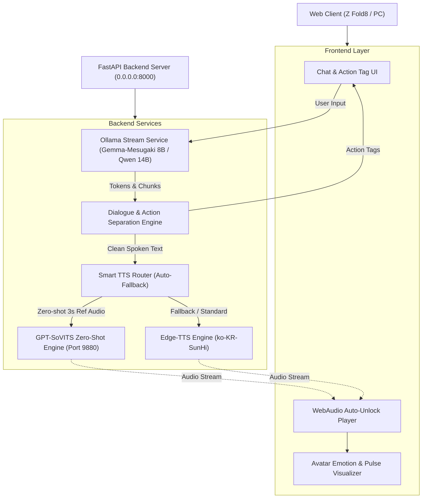

# ⚙️ Project BUKI - System Architecture Specification

---

## 🏛️ 1. 모듈 계층 및 듀얼 TTS 라우팅 아키텍처

---

## 🎙️ 2. Zero-Shot 감정 뱅크 (Dynamic Emotion Bank) 규격

* **레퍼런스 음성 레지스트리 (`src/assets/voice_samples/sample_registry.json`)**:
  * `default_ref_wav`: 기본 성우 음성 (3~5초)
  * `emotion_banks.smug`: 비웃음/장난 억양 레퍼런스
  * `emotion_banks.angry`: 화남/츤데레 억양 레퍼런스
* **동적 라우팅 메카닉**:
  * LLM 지문에서 `(팔짱을 끼며 비웃는다)` 감지 시 ➡️ `smug_ref.wav`를 레퍼런스 스타일로 자동 주입하여 합성.
  * GPT-SoVITS 오프라인 시 ➡️ 실시간 `Edge-TTS`로 무중단 자동 폴백.