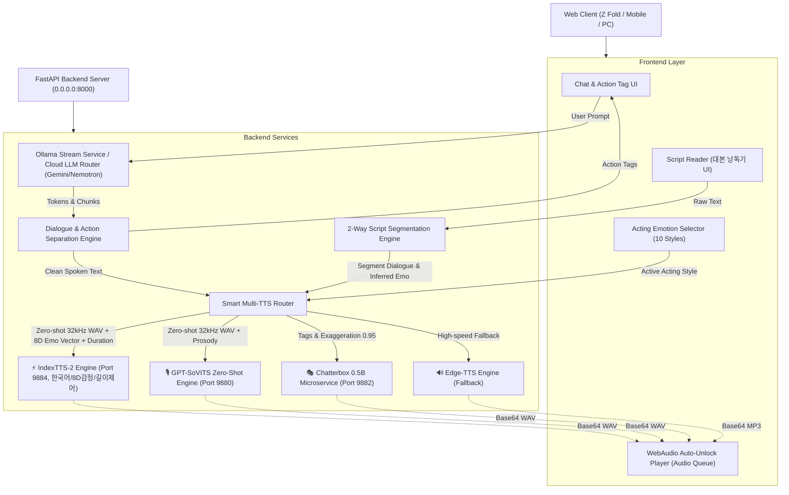

# ⚙️ Project BUKI - System Architecture Specification

---

## 🏛️ 1. 모듈 계층 및 Multi-TTS 라우팅 아키텍처 (Quad-Engine)

---

## 🎭 2. 10대 극적 연기 감정 (Acting Emotion Styles) 프로소디 규격

| 감정 모드 ID | UI 명칭 | 템포(Speed) | 호흡/발화 토큰 | 레퍼런스/태그 제어 |
| :--- | :--- | :---: | :--- | :--- |
| `sensual` | 💖 달아오름/신음 | `0.90x` | `읏, {text}~♡` | `mesugaki_smug.wav` (소악마 톤 고정) |
| `panting` | 🥵 헐떡임/숨소리 | `1.05x` | `하아, 하아, {text}` | 거친 숨소리 호흡 가중치 |
| `terrified` | 😱 공포에 질림 | `1.16x` | `히익, {text}!` | 성대 피치 떨림 + 고온도 샘플링 |
| `resigned` | 🥀 낮고 느린 체념 | `0.78x` | `하아... {text}` | 초저속 딥 모노톤 + 긴 한숨 휴지기 |
| `crying` | 😢 흐느낌/울먹임 | `0.95x` | `흑... {text}` | 서러운 흐느낌 톤 |
| `whisper` | 🤫 귓가 속삭임 | `0.92x` | `{text}` | Chatterbox `[whisper]` / 저출력 ASMR |
| `flustered` | 😳 부끄럼/당황 | `1.08x` | `앗, {text}!` | 말더듬 억양 유도 |
| `smug` | 😏 메스가키 비웃음 | `1.00x` | `풋, {text}~` | `mesugaki_smug.wav` 조롱 억양 |
| `angry` | 😡 분노/쏘아붙임 | `1.12x` | `{text}!` | `mesugaki_angry.wav` 강한 어택 |
| `auto` | 🎭 자동 감정 | 가변 | 지문 키워드 자동 분석 | 문맥 기반 실시간 전환 |

---

## 📖 3. 대본 낭독기 (Script Reader) 2-Way 파싱 규격

1. **지문 기반 자동 감정 추론 (Auto-Inference)**:
   * `"큰따옴표"` 밖의 묘사 텍스트 및 대사 속 `(괄호 지문)`을 키워드 매칭하여 문장마다 알맞은 연기 톤 자동 배정.
2. **전체 일괄 강제 오버라이드 (Global Emotion Filter)**:
   * 상단 드롭다운에서 특정 감정 선택 시 대본 전체 대사를 단일 연기 톤으로 강제 낭독.
3. **캐시 무결성 보장**:
   * 감정 모드 전환 시 `scriptAudioCache`를 즉각 무효화하여 새로운 연기 톤으로 재생성.

---

## ⚙️ 4. 설정 분리 및 동적 핫 리로드 (ConfigManager) 규격

* **중앙화 설정 저장소 (`src/backend/config/settings.json`)**:
  * 모델 카탈로그(`gemini_cloud`, `openrouter_free`, `nvidia_cloud`), API 엔드포인트 기본값, 감정별 시스템 프롬프트 템플릿, 대본 감정 키워드 룰셋을 단일 JSON으로 통합 관리.
* **싱글톤 설정 관리자 (`src/backend/core/config_manager.py`)**:
  * `.env` 우선순위 자동 주입 및 모델 카테고리 필터링 제공.
  * `POST /api/config/reload`를 통해 서버 재시작 없이 런타임 핫 리로드 지원.

---

## 📚 5. 상세 아키텍처 매뉴얼 링크

* [🎙️ YouTube 음원 채취, 분석 및 BGM 노이즈 제거 파이프라인 매뉴얼](file:///C:/Users/rerun/opendcmart/projects/project_buki/wiki/03_architecture/VOICE_EXTRACTION_AND_CLEANING_GUIDE.md)
* [🧠 GPT-SoVITS v2 파인튜닝 & 듀얼 페르소나 서빙 매뉴얼](file:///C:/Users/rerun/opendcmart/projects/project_buki/wiki/03_architecture/GPT_SOVITS_FINETUNING_MANUAL.md)