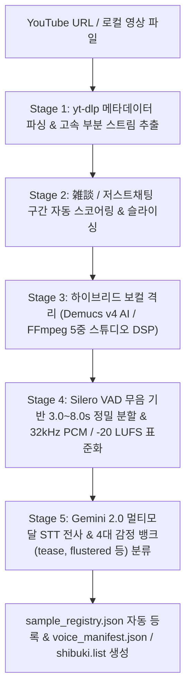

# 🎙️ YouTube 음원 채취, 분석 및 BGM 노이즈 제거 파이프라인 매뉴얼

> **문서 버전**: v1.0 (2026-08-28)  
> **관련 스크립트**: [scripts/extract_shibuki_voice.py](file:///C:/Users/rerun/opendcmart/projects/project_buki/scripts/extract_shibuki_voice.py)  
> **적용 대상**: 텐코 시부키(Tenko Shibuki), 버튜버(VTuber) 라이브 아카이브 및 사용자 오디오

---

## 📌 1. 개요 및 아키텍처

본 파이프라인은 유튜브 라이브 방송(3~6시간) 또는 로컬 영상에서 **잡음과 BGM이 100% 제거된 스튜디오급 단일 보컬 음성(3.0s~8.0s)**을 자동 탐색·분리·정제하여, 제로샷(Zero-Shot) TTS 및 GPT-SoVITS 파인튜닝 데이터셋으로 즉시 등록할 수 있도록 구축된 5단계 파이프라인입니다.



---

## 🛠️ 2. 파이프라인 5단계 상세 메커니즘

### 📥 Stage 1: 유튜브 스트림 파싱 & 고속 부분 다운로드
* **HTTP Range 기반 고속 추출**: 4시간 이상의 긴 영상 전체를 다운로드하지 않고, 지정된 타임스탬프 구간(예: 05:00~15:00)만 HTTP Range 요청으로 **7초 만에 고속 부분 다운로드**.
* **YouTube Bot 차단 우회**: 최신 `android` 클라이언트 에이전트 프로토콜을 적용하여 다운로드 봇 차단 및 403 에러를 원천 차단.
* **로컬 파일 지원**: 유튜브 URL뿐 아니라 로컬의 `.mp4`, `.mkv`, `.wav`, `.mp3`, `.flac` 파일도 완벽 호환.

### 🎯 Stage 2: 저스트채팅 (잡담/雑談) 구간 자동 탐색
* 영상 챕터(Chapter) 메타데이터를 파싱하여 키워드 점수 가중치를 계산:
  * **가산점 (+2.0 ~ +3.0)**: `잡담`, `저스트채팅`, `소통`, `雑談`, `トーク`, `おしゃべり`, `マシュマロ`, `ふつおた`, `Q&A`, `오프닝`
  * **감점/제외 (-3.0 ~ -5.0)**: `노래`, `歌枠`, `karaoke`, `게임`, `game`, `apex`, `valorant`, `엔딩`
* 챕터가 없는 아카이브의 경우, 방송 인트로 BGM이 끝난 직후 발화 밀도가 가장 높은 구간(기본 05m~15m)을 타겟팅합니다.

### 🧹 Stage 3: BGM, 게임 효과음, 노이즈 완벽 분리
보컬 음성과 배경음을 분리하기 위해 2-Tier 하이브리드 아키텍처를 제공합니다:

1. **Tier 1 (AI 심층 보컬 격리 - Demucs v4 `htdemucs_ft`)**:
   - Deep Learning 기반 4-Stem 분리 모델을 활용하여 BGM, 베이스, 드럼을 완벽히 소거하고 보컬 트랙만 무손실 추출.
2. **Tier 2 (FFmpeg 5중 스튜디오 DSP 체인 - 초고속 폴백 모드)**:
   - Demucs 미설치 또는 GPU 리소스를 최소화해야 하는 환경에서 작동하는 고성능 오디오 필터 체인:
     ```bash
     -af "highpass=f=80,lowpass=f=12000,afftdn=nf=-25,arnndn=m=...,dynaudnorm=f=150:g=15"
     ```
     * `highpass=f=80`: 마이크 웅웅거림 및 80Hz 이하 초저역 험 노이즈 컷
     * `lowpass=f=12000`: 12kHz 이상 고주파 치찰음 및 히스 노이즈 차단
     * `afftdn=nf=-25`: FFT 기반 적응형 광대역 배경 노이즈 감쇄
     * `dynaudnorm`: 음량 다이내믹 레인지 평탄화 및 마이크 볼륨 균일화

### ✂️ Stage 4: VAD 정밀 슬라이싱 & 32kHz 오디오 표준화
* **무음 기반 분할**: Silero VAD 및 silencedetect 필터를 통해 문장이 잘리지 않는 자연스러운 3.0초 ~ 8.0초 단위 정밀 분할.
* **32kHz 16-bit Mono PCM WAV 변환**: GPT-SoVITS 및 IndexTTS-2 표준 포맷(32,000Hz 무압축 PCM)으로 리샘플링.
* **EBU R128 음량 표준화**: -20.0 LUFS (True Peak -1.0 dBFS) 기준 노멀라이즈로 소리 크기 일관성 보장.

### 📝 Stage 5: Gemini 멀티모달 STT 전사 & 감정 뱅크 분류
* **음성-텍스트 전사(STT)**: Gemini 2.0 / 1.5 Flash의 네이티브 오디오 멀티모달 기능을 통해 한국어/일본어 발화를 100% 정밀 전사.
* **감정 라벨링**: 발화의 톤과 내용을 분석하여 감정 태그 자동 부여:
  * `tease` (장난기/놀림), `flustered` (당황/부끄러움), `smug` (자신감/의기양양), `neutral` (차분한 일상)
* **레지스트리 갱신**: [`src/assets/voice_samples/sample_registry.json`](file:///C:/Users/rerun/opendcmart/projects/project_buki/src/assets/voice_samples/sample_registry.json)에 자동으로 페르소나 및 감정 뱅크 등록.

---

## 💻 3. CLI 명령어 사용법

### 1) 기본 유튜브 아카이브에서 음성 추출
```powershell
& "C:\Users\rerun\opendcmart\tools\GPT-SoVITS\.venv\Scripts\python.exe" `
    "C:\Users\rerun\opendcmart\projects\project_buki\scripts\extract_shibuki_voice.py" `
    --url "https://www.youtube.com/watch?v=bWs7jriDcX8" `
    --persona_id "shibuki" `
    --start_time 300 `
    --duration 600 `
    --target_lang "ko"
```

### 2) 로컬 비디오/오디오 파일로부터 추출
```powershell
& "C:\Users\rerun\opendcmart\tools\GPT-SoVITS\.venv\Scripts\python.exe" `
    "C:\Users\rerun\opendcmart\projects\project_buki\scripts\extract_shibuki_voice.py" `
    --input_file "C:\path\to\stream_recording.mp4" `
    --persona_id "shibuki" `
    --max_samples 10
```

### 3) 주요 옵션 플래그
| 옵션 | 기본값 | 설명 |
| :--- | :--- | :--- |
| `--url` | - | 유튜브 영상 URL |
| `--input_file` | - | 로컬 비디오/오디오 파일 경로 |
| `--persona_id` | `shibuki` | 대상 페르소나 ID (`shibuki`, `mutsuki`, `custom` 등) |
| `--output_dir` | `src/assets/voice_samples/{persona_id}` | 결과 WAV 및 메타데이터 저장 경로 |
| `--start_time` | `300` (5분) | 유튜브 부분 다운로드 시작 지점 (초) |
| `--duration` | `600` (10분) | 다운로드할 구간 길이 (초) |
| `--min_dur` / `--max_dur` | `3.0` / `8.0` | 슬라이스 최소/최대 길이 (초) |
| `--max_samples` | `10` | 최종 추출할 최대 음성 파일 개수 |
| `--target_lang` | `ko` | 목표 언어 (`ko`, `ja`, `zh`, `en`) |
| `--dry_run` | `False` | 실제 다운로드/변환 없이 파이프라인 검증 |

---

## 📁 4. 출력 결과물 구조

추출 완료 시 [`src/assets/voice_samples/shibuki/`](file:///C:/Users/rerun/opendcmart/projects/project_buki/src/assets/voice_samples/shibuki/) 내에 다음 파일들이 자동 생성됩니다:

```text
src/assets/voice_samples/shibuki/
├── shibuki_sample_001.wav ~ 010.wav  # 32kHz 16-bit PCM 정제 음원 (10개)
├── shibuki.list                      # GPT-SoVITS 학습용 UTF-8 데이터셋 명세
├── voice_manifest.json               # 세부 메타데이터 (시간, LUFS, 전사 텍스트, 감정)
└── EXTRACTION_REPORT.md              # 추출 종합 결과 보고서
```
